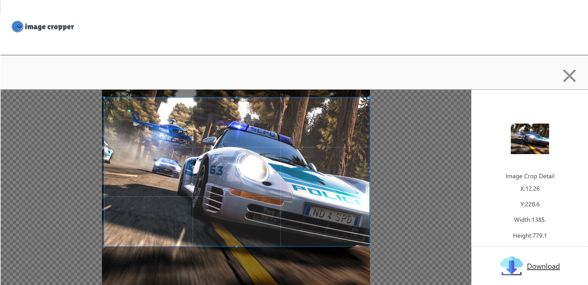

# ImageCropper

Crop any image.

## Table of contents

- [Overview](#overview)
  - [Screenshot](#screenshot)
  - [Links](#links)
- [Author](#author)

## Overview

### Screenshot

### Links

- Live Site URL: [https://csmurillo.github.io/ImageCropper/]

## Author

- Github - [@csmurillo](https://github.com/csmurillo)

